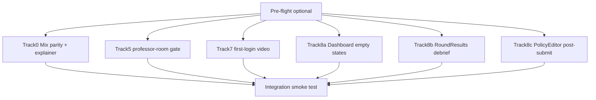

# Onboarding Multitask Guide (Archived)

**Archived:** 2026-06-25 — Wave 1 complete; integration smoke test passed.  
**Current reference:** [`docs/onboarding-plan.md`](../onboarding-plan.md)

Parallel execution companion used during Cursor Multitask / multi-agent implementation of onboarding Wave 1.

**Last updated:** 2026-06-25

---

## Final status (slices 1–8 + Wave 1)

| Slice / track | Status | Notes |
|---------------|--------|-------|
| 1–8 | Shipped | Commits `0557f35`, `3fbaf5d`, `a54bbc8` |
| Track 0 (mix parity) | Shipped | `SeasonModeConfigurator`, SeasonCreator mix modes |
| Track 5 | Shipped | Professor-room tour ownership gate |
| Track 7 | Shipped | First-login video + README env docs |
| Tracks 8a–8c | Shipped | Empty states, debrief, post-submit copy |

**Pre-flight:** Completed — all deliverables committed.  
**Integration smoke test:** Completed 2026-06-25 (see checklist below).

### Season builders (reference)

| Surface | Route | Mix modes |
|---------|-------|-----------|
| **SeasonCreator** | `/room/:roomId/create-season` | Professor class seasons — `single` / `random_mix` / `custom_mix` |
| **SeasonSprintBuilder** | `/season-sprint/new`, `/room/:roomId/season-sprint/new` | Solo/sprint — shared `SeasonModeConfigurator` |

Backend `CreateSeasonRequest` accepts `season_mode` and `mix_config`.

---

## Wave 1 — parallel tracks

### File ownership (historical — do not cross during Wave 1)

| File(s) | Track |
|---------|-------|
| `SeasonModeConfigurator.jsx`, `SeasonCreator.jsx`, `SeasonSprintBuilder.jsx`, `seasonCreatorCopy.js`, `professorSeasonTour.js`, `seasonSprintCopy.js` | **0** |
| `RoomView.jsx`, `professorRoomTour.js` | **5** |
| `OnboardingContext.jsx`, `README.md` | **7** |
| `Dashboard.jsx` | **8a** |
| `RoundResults.jsx`, `onboarding.js` | **8b** |
| `PolicyEditor.jsx` | **8c** |

---

## Track 0 — Mix mode parity + explainer

**Goal:** Professor class seasons support `single` / `random_mix` / `custom_mix` like solo sprints.

**Acceptance:**

1. Professor can create a `random_mix` class season from SeasonCreator.
2. SeasonSprintBuilder behavior unchanged.
3. Mix explainer visible under Mode dropdown on both surfaces.
4. `professor-season` tour step mentions mode + preview.

---

## Track 5 — Slice 5 fix-up

**Acceptance:**

1. Visiting a room as professor-but-not-owner does not auto-start the tour.
2. Owning professor still gets tour on first visit.

---

## Track 7 — Slice 7 finish

**Acceptance:**

1. Fresh user sees modal once after sign-in.
2. "Don't show again" prevents repeat.
3. README documents env var and YouTube/Vimeo formats.

---

## Track 8a — Dashboard empty states

**Acceptance:**

1. Student with empty dashboard sees join-room emphasis.
2. Professor with empty dashboard sees create-room emphasis.

---

## Track 8b — RoundResults debrief

**Acceptance:**

1. Callout shows once per user on first results view.
2. Dismiss persists across refresh.

---

## Track 8c — PolicyEditor post-submit

**Acceptance:**

1. Successful submit shows contextual next-steps copy (not just API message).

---

## Integration smoke test (completed 2026-06-25)

### Checklist

- [x] Track 0: Class season with `random_mix` creates successfully
- [x] Track 0: Solo sprint `custom_mix` still works
- [x] Track 0: Mix explainer visible on both builders
- [x] Track 5: Non-owner professor room — no tour
- [x] Track 5: Owner professor room — tour on first visit
- [x] Track 7: First-login modal once; dismissed respects flag
- [x] Track 8a: Student/professor empty dashboard CTAs
- [x] Track 8b: Results debrief once + dismiss
- [x] Track 8c: Post-submit next-steps copy

---

## Suggested PR split (historical)

| PR title | Tracks |
|----------|--------|
| `feat(onboarding): mix mode parity for class seasons` | 0 |
| `fix(onboarding): professor-room tour ownership gate` | 5 |
| `feat(onboarding): intro video first-login prompt` | 7 |
| `feat(onboarding): empty states and debrief polish` | 8a + 8b + 8c |

---

## Related references

| Topic | Location |
|-------|----------|
| Master plan | `docs/onboarding-plan.md` |
| Mix simulation | `backend/simulation/season_scenarios.py` |
| Create season API | `backend/routes/seasons.py` |
| Sprint copy | `frontend/src/lib/seasonSprintCopy.js` |
| Class season copy | `frontend/src/lib/seasonCreatorCopy.js` |
