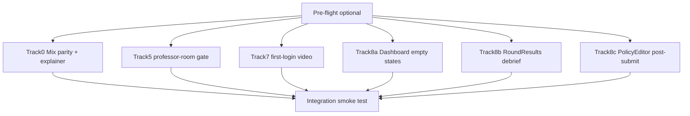

# Onboarding Multitask Guide

Parallel execution companion for [`onboarding-plan.md`](onboarding-plan.md).

**Source of truth for scope and acceptance:** `docs/onboarding-plan.md`  
**This file is for Cursor Multitask / multi-agent sessions only.** Do not edit the master plan from agent tracks.

**Last updated:** 2026-06-24

---

## Current status (slices 1–8 + Wave 1)

| Slice / track | Status | Notes |
|---------------|--------|-------|
| 1–4, 6 | Done (committed) | — |
| Track 0 (mix parity) | **Code complete** (working tree) | `SeasonModeConfigurator`, SeasonCreator mix modes |
| Track 5 | **Code complete** (working tree) | Professor-room tour ownership gate |
| Track 7 | **Code complete** (working tree) | First-login video + README env docs |
| Tracks 8a–8c | **Code complete** (working tree) | Empty states, debrief, post-submit copy |

**Remaining before ship:**

1. **Pre-flight** — land untracked/uncommitted deliverables (slices 2/4/6 + Wave 1 tracks); confirm dev stack starts cleanly.
2. **Integration smoke test** — run checklist below; none checked off yet.

### Season builders (reference)

| Surface | Route | Mix modes today |
|---------|-------|-----------------|
| **SeasonCreator** | `/room/:roomId/create-season` | Professor class seasons — mix modes wired (Track 0, working tree) |
| **SeasonSprintBuilder** | `/season-sprint/new`, `/room/:roomId/season-sprint/new` | Solo/sprint — mix modes via shared `SeasonModeConfigurator` |

Backend `CreateSeasonRequest` already accepts `season_mode` and `mix_config`. Track 0 is frontend-only.

---

## Pre-flight (optional, run once before Wave 1)

One agent, sequential:

1. Land untracked slice 2/4/6 deliverables if not yet committed (`DashboardChecklist.jsx`, `PresetPreview*.jsx`, `EnterTheArena.jsx`, etc.).
2. Confirm `npm run dev` (frontend) and backend start cleanly.
3. Branch from latest main (or current integration branch).

**Prompt:**

> Land untracked onboarding files from slices 2, 4, 6. Do not change behavior. Follow repo commit style.

---

## Wave 1 — parallel tracks

### File ownership (do not cross)

| File(s) | Track |
|---------|-------|
| `SeasonModeConfigurator.jsx`, `SeasonCreator.jsx`, `SeasonSprintBuilder.jsx`, `seasonCreatorCopy.js`, `professorSeasonTour.js`, `seasonSprintCopy.js` | **0** |
| `RoomView.jsx`, `professorRoomTour.js` | **5** |
| `OnboardingContext.jsx`, `README.md` | **7** |
| `Dashboard.jsx` | **8a** |
| `RoundResults.jsx`, `onboarding.js` | **8b** |
| `PolicyEditor.jsx` | **8c** |

Track 0 owns the slice 8 mix-mode explainer (inside shared component). No separate explainer agent.

---

## Track 0 — Mix mode parity + explainer

**Goal:** Professor class seasons support `single` / `random_mix` / `custom_mix` like solo sprints.

**Prompt:**

> Implement mix-mode parity per `docs/onboarding-multitask.md` Track 0. Extract shared `SeasonModeConfigurator` from `SeasonSprintBuilder.jsx`, refactor SprintBuilder to use it, wire `SeasonCreator.jsx` to send `season_mode` and `mix_config` on create and preview. Add mix-mode explainer copy in the shared component. Update `professorSeasonTour.js`. Backend already supports mix modes — no API changes unless tests fail. Do not edit `docs/onboarding-plan.md`.

**Acceptance:**

1. Professor can create a `random_mix` class season from SeasonCreator.
2. SeasonSprintBuilder behavior unchanged.
3. Mix explainer visible under Mode dropdown on both surfaces.
4. `professor-season` tour step mentions mode + preview.

---

## Track 5 — Slice 5 fix-up

**Prompt:**

> Complete slice 5 acceptance gap: `professor-room` tour only auto-starts when `room.professor_id === user.user_id`. Touch `RoomView.jsx` and `professorRoomTour.js` only.

**Acceptance:**

1. Visiting a room as professor-but-not-owner does not auto-start the tour.
2. Owning professor still gets tour on first visit.

---

## Track 7 — Slice 7 finish

**Prompt:**

> Complete slice 7: auto-open `IntroVideoModal` once on first login when `!isVideoDismissed(userId)`, analytics source `first_login`; document `VITE_INTRO_VIDEO_URL` in README. Touch `OnboardingContext.jsx` and `README.md` only.

**Acceptance:**

1. Fresh user sees modal once after sign-in.
2. "Don't show again" prevents repeat.
3. README documents env var and YouTube/Vimeo formats.

---

## Track 8a — Dashboard empty states

**Prompt:**

> Complete slice 8 dashboard item: role-specific empty states when user has no rooms and no solo seasons — student primary CTA "Join room", professor primary CTA "Create room". Touch `Dashboard.jsx` only.

**Acceptance:**

1. Student with empty dashboard sees join-room emphasis.
2. Professor with empty dashboard sees create-room emphasis.

---

## Track 8b — RoundResults debrief

**Prompt:**

> Complete slice 8 RoundResults item: first-visit dismissible callout tying stockouts/service level to Learn concepts. Persist dismiss in `onboarding.js`. Touch `RoundResults.jsx` and `onboarding.js` only.

**Acceptance:**

1. Callout shows once per user on first results view.
2. Dismiss persists across refresh.

---

## Track 8c — PolicyEditor post-submit

**Prompt:**

> Complete slice 8 PolicyEditor item: after submit, show "what happens next" (deadline, scoring, results). Touch `PolicyEditor.jsx` only.

**Acceptance:**

1. Successful submit shows contextual next-steps copy (not just API message).

---

## Integration (after all tracks merge)

**Prompt:**

> Smoke-test onboarding multitask deliverables: professor creates random_mix class season; student creates solo custom_mix season; first-login video; room tour only on owned room; debrief dismisses once; post-submit copy visible.

### Checklist

- [ ] Track 0: Class season with `random_mix` creates successfully
- [ ] Track 0: Solo sprint `custom_mix` still works
- [ ] Track 0: Mix explainer visible on both builders
- [ ] Track 5: Non-owner professor room — no tour
- [ ] Track 5: Owner professor room — tour on first visit
- [ ] Track 7: First-login modal once; dismissed respects flag
- [ ] Track 8a: Student/professor empty dashboard CTAs
- [ ] Track 8b: Results debrief once + dismiss
- [ ] Track 8c: Post-submit next-steps copy

---

## Suggested PR split

| PR title | Tracks |
|----------|--------|
| `feat(onboarding): mix mode parity for class seasons` | 0 |
| `fix(onboarding): professor-room tour ownership gate` | 5 |
| `feat(onboarding): intro video first-login prompt` | 7 |
| `feat(onboarding): empty states and debrief polish` | 8a + 8b + 8c |

---

## Related references

| Topic | Location |
|-------|----------|
| Master plan | `docs/onboarding-plan.md` |
| Mix simulation | `backend/simulation/season_scenarios.py` |
| Create season API | `backend/routes/seasons.py` |
| Sprint copy | `frontend/src/lib/seasonSprintCopy.js` |
| Class season copy | `frontend/src/lib/seasonCreatorCopy.js` |
